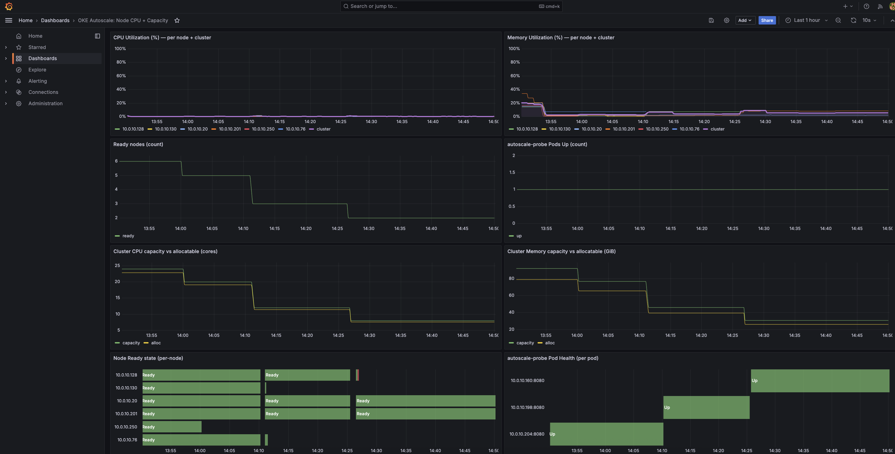

# OCI OKE Autoscaler Demo

Deploy a CPU‑intensive demo app (**autoscale-probe**) and a separate **Grafana** deployment.  
Each component is exposed through its **own** OCI Layer‑7 Load Balancer **on port 80**.

- **App:** `http://<APP_LB_IP>/` (port **80** → container **8080**)  
- **Health:** `http://<APP_LB_IP>/healthz`  
- **Grafana:** `http://<GRAFANA_LB_IP>/` (port **80** → container **3000**, default creds `admin` / `admin` — change in prod)

> The manifest includes: Metrics Server, Prometheus, HorizontalPodAutoscaler (HPA) (Ensure the OCI Cluster Autoscaler add‑on is Enabled).

---

## Table of Contents

- [Overview](#overview)
- [Architecture](#architecture)
- [What’s in the Manifest](#whats-in-the-manifest)
- [Prerequisites](#prerequisites)
- [Deploy](#deploy)
- [Grab the Load Balancer IPs](#grab-the-load-balancer-ips)
- [Use the App and Grafana](#use-the-app-and-grafana)
- [Sample Grafana Dashboard](#sample-grafana-dashboard)
- [Generate Load & Watch Autoscaling](#generate-load--watch-autoscaling)
- [Enable the OCI Cluster Autoscaler](#enable-the-oci-cluster-autoscaler)
- [Troubleshooting](#troubleshooting)
- [Cleanup](#cleanup)

---

## Overview

This setup targets **OKE** and demonstrates HPA‑driven scaling of a CPU‑bound app while visualizing metrics in **Grafana**.  
**Grafana runs in its own Deployment** and is published by a **separate** `Service` of type `LoadBalancer`.

**Metrics sources used by the grafana bundled dashboard:**
- **CPU & Memory Utilization (per‑node + cluster):** from **kubelet cAdvisor** (`container_*`, `machine_*`).
- **Node readiness & capacity/allocatable:** custom gauges exported by `autoscale-probe` (`k8s_node_*`).
- **Pods Up & Pod Health:** from Prometheus `up{job="autoscale-probe"}` (labels added via relabeling).

---

## Architecture

```
                      +-----------------------------+         +-----------------------------+
                      |   OCI LB (App)              |         |   OCI LB (Grafana)          |
Internet  ----------->|   Port 80 ---> / (App)      |         |   Port 80 ---> / (Grafana)  |
                      +-----------------------------+         +-----------------------------+
                                 |                                        |
                       Service: autoscale-probe-lb               Service: grafana
                       (ns: autoscale)                           (ns: monitoring)
                                 |                                        |
                      +-------------------------+                 +-------------------------+
                      |  Pod: autoscale-probe   |                 |  Pod: grafana           |
                      |  Container: app (8080)  |                 |  Container: grafana     |
                      +-------------------------+                 +-------------------------+

Namespaces:
- autoscale   : app + Services (LB + metrics) + HPA
- monitoring  : Grafana + Prometheus + Grafana provisioning ConfigMaps
- kube-system : CertManager + metrics-server + Cluster Autoscaler (enable addons in OKE)
```

---

## What’s in the Manifest

- **Namespace `autoscale`**
  - `Deployment autoscale-probe` (container: **app**)
  - `Service autoscale-probe-lb` (type **LoadBalancer**, port **80** → app)
  - `Service autoscale-probe-metrics` (ClusterIP for Prometheus scraping)
  - `HorizontalPodAutoscaler autoscale-probe-hpa` (60% CPU, 1→20 replicas)
    - Cluster Autoscaler adds nodes when pods become unschedulable and removes them when nodes are underused.

- **Namespace `monitoring`**
  - `Deployment grafana` + `Service grafana` (**LoadBalancer** on port **80**)
  - Grafana provisioning `ConfigMap`:
    - `grafana-datasource` → Prometheus datasource
    - `grafana-dashboard`  → “OKE Autoscale” dashboard JSON
    - `grafana-dash-provider` → dashboard file provider
  - `Deployment prometheus` + `Service prometheus` (ClusterIP)

- **Namespace `kube-system`**
  - `cert-manager` (enable the addon in OKE)
  - `metrics-server` (enable the addon in OKE)
  - `Cluster Autoscaler` (enable the addon in OKE)

---

## Prerequisites

- **OKE** cluster with the **OCI Cloud Controller Manager** (for LBs)
- `kubectl` configured to point at your cluster
- (Optional) [`hey`](https://github.com/rakyll/hey) for load generation
- Egress access for image pulls (ghcr.io, grafana, prometheus, k8s images)

> **Security:** Grafana defaults to `admin/admin` in this demo. For production, inject credentials via a `Secret` and env, or use an IdP.

---

## Deploy

**Clone repo:**

```bash
git clone https://github.com/cj667113/OCI_K8_AUTOSCALING_APP.git
cd OCI_K8_AUTOSCALING_APP
kubectl apply -f oke-autoscale.yaml
```

---

## Grab the Load Balancer IPs

```bash
kubectl -n autoscale   get svc autoscale-probe-lb -w
kubectl -n monitoring  get svc grafana -w
```

When **EXTERNAL-IP** appears, use those as `APP_LB_IP` and `GRAFANA_LB_IP`.

---

## Use the App and Grafana

```text
App (root)    : http://<APP_LB_IP>/
Health        : http://<APP_LB_IP>/healthz
Grafana (UI)  : http://<GRAFANA_LB_IP>/  (admin / admin)
```

Prometheus is internal (ClusterIP):
```bash
kubectl -n monitoring get svc prometheus
```

> If you update the dashboard ConfigMap and don’t see changes, reload Grafana:
> ```bash
> kubectl -n monitoring rollout restart deploy/grafana
> ```

---

## Sample Grafana Dashboard

<p align="center"> <a href="images/sample.png">  </a> </p> <sub><em>Grafana dashboard included via ConfigMaps (see <code>grafana-dashboard</code> and <code>grafana-datasource</code> in the manifest).</em></sub>

---

## Generate Load & Watch Autoscaling

The HPA targets **60% CPU** with `minReplicas: 1`, `maxReplicas: 20`.

Generate sustained CPU load for 500s with concurrency 72:
```bash
hey -z 500s -c 72 -disable-keepalive "http://<APP_LB_IP>/burn?cpu_ms=100"
```

Observe metrics and scaling:
```bash
watch -n 1 kubectl top pods -A
kubectl -n autoscale get hpa autoscale-probe
kubectl get nodes -w
```

---

## Enable the OCI Cluster Autoscaler

Docs:  
- [Cluster Autoscaler add-on overview](https://docs.oracle.com/en-us/iaas/Content/ContEng/Tasks/contengaddonmanagement_topic.htm)  
- [Cluster Autoscaler add-on configuration arguments](https://docs.oracle.com/en-us/iaas/Content/ContEng/Tasks/contengconfiguringclusteraddons-configurationarguments.htm#contengconfiguringclusteraddons-configurationarguments_ClusterAutoscaler)

OCI CLI example:
```bash
oci ce cluster update-addon --addon-name ClusterAutoscaler --from-json file://<path-to-config-file> --cluster-id <cluster-ocid>
kubectl -n kube-system rollout restart deploy/cluster-autoscaler
```

Tail autoscaler logs:
```bash
kubectl -n kube-system logs -f deploy/cluster-autoscaler | egrep -i "scale-down|unneeded|removing|utilization|NoScaleDown"
```

---

## Troubleshooting

**No EXTERNAL-IP on Service**
- `kubectl -n autoscale describe svc autoscale-probe-lb`
- `kubectl -n monitoring describe svc grafana`
- Verify OCI CCM is running and LB quota/permissions are OK
- Ensure subnet/security lists allow inbound **80**

**Grafana not loading**
- Confirm security lists / firewall for `<GRAFANA_LB_IP>:80`
- `kubectl -n monitoring logs deploy/grafana`

**HPA shows unknown metrics**
- `kubectl get apiservices | grep metrics` → `v1beta1.metrics.k8s.io` must be **Available**
- `kubectl top pods -A` should return CPU/Memory (metrics-server healthy)
- `kubectl -n autoscale describe hpa autoscale-probe` for details

---

## Cleanup

```bash
kubectl delete -f oke-autoscale.yaml
```

---

### Handy Commands (copy/paste)

```bash
kubectl apply -f oke-autoscale.yaml
kubectl -n kube-system rollout restart deploy/cluster-autoscaler
kubectl get nodes
watch -n 1 kubectl top pods -A
kubectl get pods -n kube-system
kubectl get pods -n autoscale
kubectl get pods -n monitoring
kubectl top pods -A | head
kubectl -n kube-system logs -f deploy/cluster-autoscaler | egrep -i "scale-down|unneeded|removing|utilization|NoScaleDown"
kubectl get nodes -w

# Load test (replace APP_LB_IP)
hey -z 500s -c 72 -disable-keepalive "http://<APP_LB_IP>/burn?cpu_ms=100"
```

---

Enjoy! 🎉